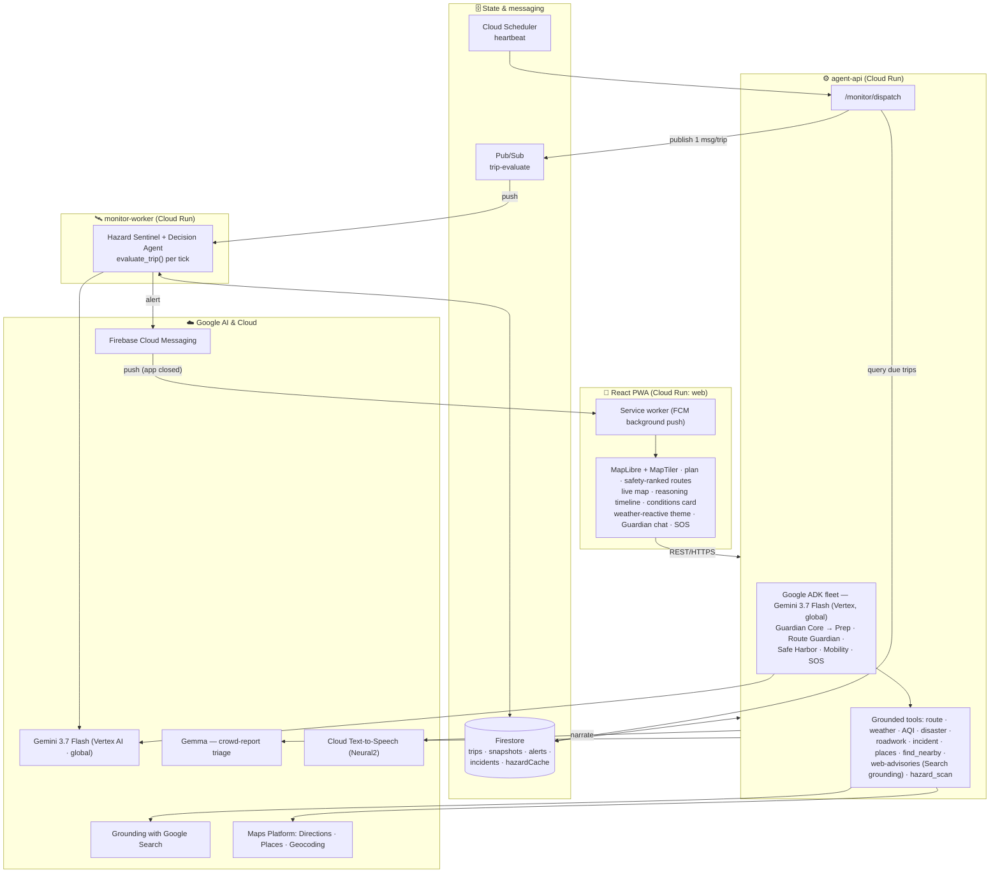
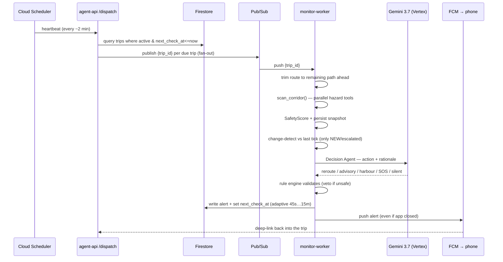
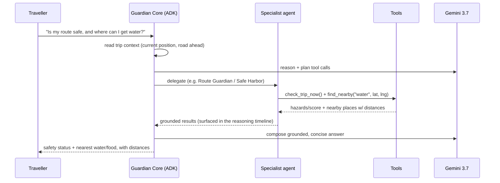

# SafeJourney — Architecture

## One-paragraph summary

SafeJourney is a **multi-agent, event-driven** system that keeps a traveller safe on the
*specific* route they are taking. A React PWA plans a trip; the **agent-api** (Google **ADK** +
**Gemini 3.7 Flash** on Vertex AI, Cloud Run) pre-detects hazards across candidate routes and
returns them **safety-ranked**. Once a trip is active, an autonomous loop —
**Cloud Scheduler → dispatcher → Pub/Sub → monitor-worker** — re-scans the *road ahead* on an
adaptive interval, detects what is **newly** dangerous (change-detection), decides an action
with Gemini (validated by a deterministic rule engine), writes an alert to **Firestore**, and
pushes it to the phone via **Firebase Cloud Messaging (FCM)** — even with the app closed.

---

## System architecture



<details><summary>ASCII fallback</summary>

```
        React PWA (Vite · MapLibre+MapTiler · FCM · service worker)
              │  REST/HTTPS                              ▲  FCM push
              ▼                                          │
   ┌───────────────────────────┐            ┌────────────────────────────┐
   │  agent-api  (Cloud Run)    │            │ monitor-worker (Cloud Run) │
   │  Google ADK · Gemini 3.7   │            │ Hazard Sentinel + Decision │
   │  Guardian Core → Prep /    │◄─ Pub/Sub  │ evaluate_trip() per tick   │
   │  Route Guardian / Safe     │  (fan-out) └──────────▲─────────────────┘
   │  Harbor / Mobility / SOS   │                       │ publish due trips
   └──────────┬────────────────┘            ┌──────────┴──────────┐
              ▼ read/write                    │   Cloud Scheduler   │ heartbeat
        Firestore  ◄────────────────────────┤   → /monitor/dispatch
   (trips·snapshots·alerts·incidents)        └─────────────────────┘
```
</details>

---

## Google products used

| Product | Role in SafeJourney |
|---|---|
| **Gemini 3.7 Flash** (Vertex AI, `global` location) | Reasoning behind every agent — route selection, monitoring decisions, prep verdicts, alert narration, chat |
| **Google Agent Development Kit (ADK)** | Multi-agent fleet, agent-to-agent delegation, tool-calling, session memory |
| **Grounding with Google Search** (Gemini) | Live, cited web advisories (roadwork / waterlogging / sewage / closures) snapped onto the route |
| **Gemma** (`gemma-4-26b-a4b-it`, Gemini API) | Second model — high-volume crowd-report triage (free-text / voice → structured hazard schema) |
| **Cloud Text-to-Speech** (`en-IN-Neural2-A`) | Hands-free turn-by-turn + hazard narration (browser-speech fallback offline) |
| **Cloud Run** | Three scale-to-zero services: `agent-api`, `monitor-worker`, `web` |
| **Firestore** | Trips, hazard snapshots, alerts, crowd incidents, hazard cache |
| **Cloud Scheduler** | Heartbeat that drives the autonomous monitoring loop |
| **Pub/Sub** | Per-trip fan-out of monitoring work to the worker |
| **Firebase Cloud Messaging (FCM)** | App-closed push alerts, deep-linking into the alerting trip |
| **Google Maps Platform** | Directions (routes), Places API New (`searchNearby` + `searchText`), Geocoding |
| **Cloud Build + Artifact Registry** | Container build & image registry |
| **Cloud Logging** | Observability of Scheduler runs, Pub/Sub delivery, agent traces |

> **Gemini 3.x access note:** for this project, Vertex serves Gemini 3.x **only on the `global`
> location** (regional endpoints 404 on 3.x). The Developer API (AI Studio) also has 3.x but its
> free tier caps at ~20 req/day, so the reliable, full-quota path is **Vertex + `global`**
> (`GOOGLE_GENAI_USE_VERTEXAI=true`, `GOOGLE_CLOUD_LOCATION=global`).

*Non-Google, keyless grounding (honest degradation):* Open-Meteo (weather + AQI + visibility),
OpenStreetMap Overpass (roadwork, road-condition tags, rail crossings), GDACS (global
disasters), a curated GLOF/landslide-basin list, and an accident-blackspot DB.

---

## The agent fleet (Google ADK)

| Agent | Role | Key tools |
|---|---|---|
| **Guardian Core** | Root orchestrator; delegates, holds memory, decides when to speak, answers chat | all |
| **Prep** | Pre-trip go / caution / wait + conditions-aware checklist | `plan_safe_routes`, `get_precautions` |
| **Route Guardian** | Safety-rank routes, pick the safest viable one | `plan_safe_routes`, `scan_route_hazards` |
| **Hazard Sentinel** | Background per-tick corridor scan (in the worker) | `scan_corridor` (all hazard tools) |
| **Safe Harbor** | Nearest vetted refuge to wait out a hazard | `get_safe_harbors` (Places) |
| **Mobility** | Transit / cab alternatives when the plan breaks | `get_mobility_options`, `get_safe_harbors` |
| **SOS** | Escalation, contacts, 112, first-response guidance | `get_safe_harbors` |
| **Decision Agent** (in tick) | new hazards + trip profile → action + rationale (Gemini) | validated by the rule engine |

### Tools the agents call

`plan_safe_routes` · `scan_route_hazards` · `get_safe_harbors` · **`find_nearby`** (water / food
/ ATM / pharmacy / fuel near the traveller) · `get_mobility_options` · `check_trip_now` ·
`get_precautions` · `report_incident`. Hazard detection fans out across: **weather** (Open-Meteo),
**air quality / visibility** (Open-Meteo), **disaster** (GDACS + GLOF basins), **roadwork /
road-condition** (OSM Overpass), **incident** (Firestore crowd + official reports), **blackspot**
(accident DB), **geometry** (sharp turns / unlit), and **web-advisories** (Gemini Search grounding).

---

## Agentic workflow — one monitoring tick (autonomous)



## Agentic workflow — Guardian chat (interactive)



**Why it's agentic, not scripted:** multi-step tool use, real **delegation** between agents
(visible in the app's reasoning timeline), **autonomous** background operation on an interval it
sets for itself, **change-detection** so it interrupts only on genuinely new danger, and a
**self-validating** decision (a deterministic rule engine can veto a model action so a
hallucination can never make the route *less* safe).

---

## Key data flow: `evaluate_trip()`

1. **Cloud Scheduler** → `POST /monitor/dispatch`.
2. Dispatcher queries Firestore: `trips where status==active and next_check_at<=now`.
3. Each due trip → publish `{trip_id}` to Pub/Sub `trip-evaluate` (fan-out).
4. **monitor-worker** receives the push → `evaluate_trip(trip_id)`:
   - trim the route to the **remaining** path ahead of the current position;
   - `scan_corridor` fans out across hazard tools in parallel (hard time budget so a slow feed can't stall the tick);
   - compute `SafetyScore`, persist a **snapshot**;
   - **change-detect** vs last tick's hazard keys → only *new / escalated* hazards;
   - Decision Agent (Gemini) → silent / advisory / reroute / harbour / SOS, **validated** by the rule engine;
   - on reroute, switch the trip to a safer route; write the **alert**; **FCM push**;
   - set `next_check_at` **adaptively** (≈45 s near a critical hazard … 15 min when clear).

---

## Local ↔ Cloud parity

Every external dependency degrades gracefully: Open-Meteo needs no key; Maps / Gemini / Firestore
fall back to synthetic routes / rule-based decisions / in-memory storage. The **same code** runs
offline for development and, with env vars set, on Google Cloud for the live submission.
